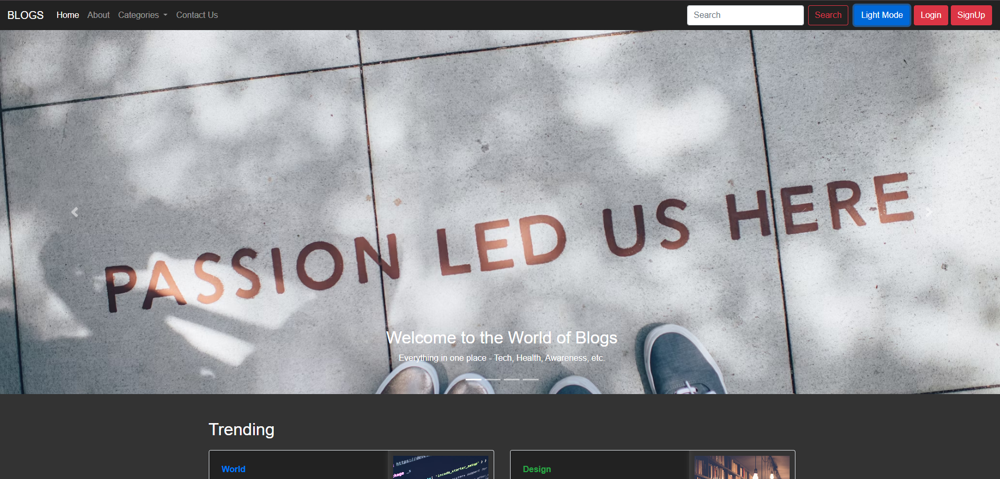

# Blog Website

Welcome to my **Blog Website**! This is a responsive and interactive blog platform built using **HTML, CSS, JavaScript, and Bootstrap**.

## 🌐 Live Demo
[Check out the live website here](https://dipayansadhukhan.github.io/Blog-Website/)

## 📌 Features
- 📖 Beautiful and responsive blog layout
- 🎨 Styled using Bootstrap for a modern look
- ⚡ Smooth and interactive user experience
- 📱 Mobile-friendly design
- 🖼️ Image and content integration

## 🛠️ Technologies Used
- **HTML** - Structure of the website
- **CSS** - Styling and layout
- **JavaScript** - Interactivity
- **Bootstrap** - Responsive and modern UI components

## 🚀 How to Use
1. Clone the repository:
   ```sh
   git clone https://github.com/DipayanSadhukhan/Blog-Website.git
   ```
2. Open the project folder and run `index.html` in a browser.

## 📸 Screenshot


## 📩 Contact
Feel free to connect with me for any suggestions or feedback!

🔗 **GitHub**: [Dipayan Sadhukhan](https://github.com/DipayanSadhukhan)
